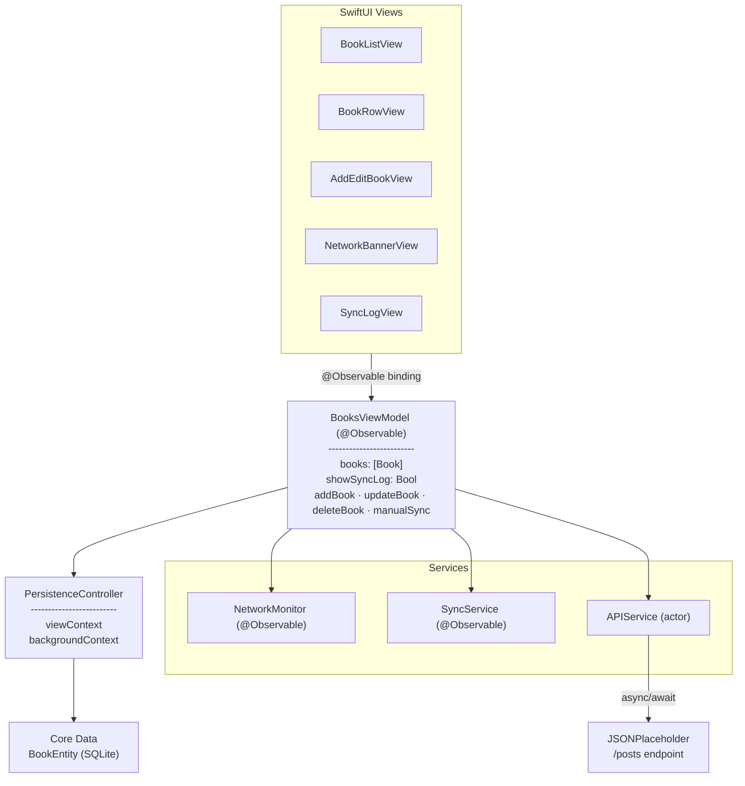
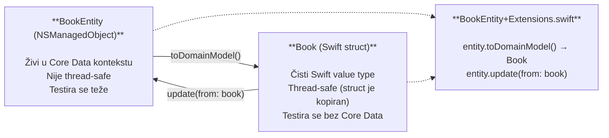

#  Trusty Bookshelf

Kreiranje iOS aplikacije sa offline-first arhitekturom koristeći Swift, Apple-ov moderan programski jezik, i SwiftUI, deklarativni UI framework. Ključni koncepti, arhitekturalni obrasci i demonstracija otporne mobilne aplikacije koja funkcioniše i bez internet konekcije.

[Šta je Offline-First?](#šta-je-offline-first) <br />
[Ključne tehnologije](#ključne-tehnologije) <br />
[Arhitektura aplikacije](#arhitektura-aplikacije) <br />
[Core Data model](#core-data-model) <br />
[Životni ciklus sinhronizacije](#životni-ciklus-sinhronizacije) <br />
[Prednosti i mane](#prednosti-i-mane) <br />
[Preduslovi](#preduslovi) <br />
[Kreiranje projekta od nule](#kreiranje-projekta-od-nule) <br />
[Pokretanje testova](#pokretanje-testova) <br />
[Konkurentna rešenja](#konkurentna-rešenja) <br />
[Reference](#reference) <br />

# Šta je Offline-First?

**Offline-First** je arhitekturalni pristup gde aplikacija tretira lokalnu bazu podataka kao primarni izvor istine, a mrežnu sinhronizaciju kao opcionalnu pozadinsku operaciju.

Zamislite sledeći scenario:

> Korisnik je u vozu koji prolazi kroz tunel. Želi da zapamti knjigu koju je upravo počeo da čita. Otvori aplikaciju, popuni formu i tapne **"Sačuvaj"**. Aplikacija prikazuje grešku:
>
> **❌ "Nema internet konekcije. Pokušajte ponovo."**
>
> Podaci su izgubljeni.

Ovo je primer **naivnog pristupa** — aplikacija direktno poziva API na svakoj korisničkoj akciji, i bez mreže ne može ništa da uradi.

```swift
// ❌ NAIVNI PRISTUP — direktan API poziv na dugme "Sačuvaj"
func saveBook() async {
    guard isConnected else {
        showError("No internet connection")  // podaci izgubljeni
        return
    }
    try await api.createBook(title: title, author: author)
}
```

**Offline-first** invertuje ovaj pristup: lokalna baza podataka je uvek izvor istine. Mreža je opciona.

```swift
// ✅ OFFLINE-FIRST PRISTUP — uvek sačuvaj lokalno, sinhroniziraj u pozadini
func saveBook() {
    persistLocally(title: title, author: author, syncStatus: .pending)
    // Operacija je gotova — korisnik odmah vidi rezultat
    // Sinhronizacija se dešava kada mreža postane dostupna
}
```

### Tri garancije:

| Garancija | Objašnjenje |
|---|---|
| **Rad bez mreže** | Aplikacija funkcioniše potpuno normalno bez internet konekcije |
| **Brzina** | UI odgovara momentalno jer čita iz lokalnog SQLite-a, ne čeka API |
| **Trajnost podataka** | Nijedno korisnikovo unošenje ne može biti izgubljeno zbog mrežne greške |

# Ključne tehnologije

### SwiftUI i `@Observable` (iOS 17)

SwiftUI je Apple-ov deklarativni UI framework. `@Observable` makro (Observation framework, iOS 17) zamenjuje stariji `ObservableObject` + `@Published` pattern. Automatski prati koje properties view koristi i ponovo ga renderuje samo kada se njihova vrednost promeni.

```swift
// iOS 16 — ObservableObject + @Published
class BooksViewModel: ObservableObject {
    @Published var books: [Book] = []
    // Svaka @Published promena obaveštava SVE subscribere
}

// iOS 17 — @Observable (granularno, bez boilerplate-a)
@Observable
final class BooksViewModel {
    var books: [Book] = []  // @Observable makro preuzima praćenje promena
}
```

### Core Data

Apple-ov ORM (Object-Relational Mapper) iznad SQLite. Ključne komponente:
* **`NSManagedObjectContext`** — unit-of-work pattern; atomske izmene; mora se koristiti na ispravnom thread-u<br />
* **`NSPersistentContainer`** — enkapsulacija celog stack-a<br />
* **`automaticallyMergesChangesFromParent`** — propagira pozadinske save-ove u UI kontekst<br />

### Network.framework — `NWPathMonitor`

Moderni Apple API za praćenje mrežne dostupnosti (zamena za stariji `Reachability`):

```swift
monitor.pathUpdateHandler = { path in
    DispatchQueue.main.async {
        self.isConnected = path.status == .satisfied
    }
}
monitor.start(queue: DispatchQueue(label: "NetworkMonitor"))
```

### Swift Concurrency — `async/await` i `actor`

`async/await` (Swift 5.5+) eliminiše callback piramide. `actor` garantuje thread safety bez DispatchQueue ili NSLock:

```swift
// actor — Swift kompajler garantuje da samo jedan task istovremeno pristupa metodama
actor APIService {
    func createPost(title: String, body: String) async throws -> RemotePost {
        let (data, _) = try await session.data(for: request)
        return try JSONDecoder().decode(RemotePost.self, from: data)
    }
}
```

### XcodeGen

Generiše `.xcodeproj` iz čitljivog `project.yml` fajla. Prednosti:
* `.xcodeproj` sadrži binarni `.pbxproj` — git diff-ovi su nečitljivi<br />
* `project.yml` je 60 linija YAML-a — lak za pregled i merge<br />
* Svako ko klonira repo može odmah da generiše projekat: `xcodegen generate`<br />

# Arhitektura aplikacije



### Odvajanje domain modela od Core Data

Views i ViewModels nikad ne uvoze `CoreData` — rade isključivo sa `Book` struct-om:



### Dva Core Data konteksta: glavni (UI) i pozadinski (sync)

Core Data nije thread-safe — svaki kontekst mora biti korišćen samo na svom thread-u. Zato aplikacija koristi **dva** konteksta: `viewContext` za čitanje na main thread-u (UI), i `backgroundContext` za pisanje tokom sinhronizacije na pozadinskom thread-u.

```swift
// viewContext: MAIN thread — jedino za UI čitanje
var viewContext: NSManagedObjectContext {
    container.viewContext
}

// backgroundContext: POZADINSKI thread — za pisanje tokom sync-a
lazy var backgroundContext: NSManagedObjectContext = {
    let ctx = container.newBackgroundContext()
    ctx.mergePolicy = NSMergeByPropertyObjectTrumpMergePolicy
    return ctx
}()

// Ključna linija — background save se automatski propagira u viewContext:
container.viewContext.automaticallyMergesChangesFromParent = true
```

# Core Data model

### Atributi `BookEntity`

| Atribut | Tip | Podrazumevano | Opis |
|---|---|---|---|
| `id` | UUID | — | Uređaj-generisani identifikator. Jedinstven bez servera. |
| `title` | String | `""` | Naslov knjige |
| `author` | String | `""` | Autor |
| `rating` | Int16 | `3` | Ocena 1–5 |
| `notes` | String? | nil | Opcione beleške |
| `isRead` | Bool | false | Da li je knjiga pročitana |
| `syncStatus` | String | `"pending"` | `"pending"` / `"synced"` / `"failed"` |
| `remoteId` | Int64 | `0` | ID sa servera; `0` = još nije sinhronizovano |
| `createdAt` | Date | — | Datum kreiranja |
| `updatedAt` | Date | — | Datum poslednje izmene |

### Zašto `syncStatus` kao String?

Core Data nema nativan tip za Swift enume. Standardni pattern je čuvati `rawValue` kao String:

```swift
enum SyncStatus: String {
    case pending = "pending"
    case synced  = "synced"
    case failed  = "failed"
}

// Konverzija u BookEntity+Extensions.swift:
SyncStatus(rawValue: entity.syncStatus ?? "pending") ?? .pending
```

### Zašto `id` generiše uređaj?

Ako bi `id` dodeljivao server, ne bismo mogli kreirati rekord dok smo offline. UUID-ovi generisani na uređaju rešavaju ovaj problem — rekord postoji lokalno odmah, a server prihvata UUID kao strani ključ.

# Životni ciklus sinhronizacije

```mermaid
flowchart TD
    A["**1. Korisnik kreira/menja knjigu**"]
    B["**2. Core Data save**<br/>(syncStatus = \"pending\", remoteId = 0)<br/>Ovo je UVEK uspešno — ne zavisi od mreže"]
    C["**3. BooksViewModel proverava:**<br/>effectivelyOnline?"]

    A --> B --> C

    C -->|DA| D["**4. SyncService.syncPendingBooks()**<br/>Fetch svih \"pending\" i \"failed\" knjiga<br/>Za svaku knjigu:"]
    C -->|NE| E["Knjiga čeka u lokalnoj bazi<br/>(syncStatus=\"pending\")"]

    D --> F{"remoteId == 0?"}
    F -->|DA| G["POST<br/>/posts"]
    F -->|NE| H["PUT<br/>/posts/{id}"]

    G --> I{"HTTP 201/200 ?"}
    H --> I

    I -->|DA| J["syncStatus = \"synced\"<br/>remoteId = server_id"]
    I -->|NE| K["Mrežna greška<br/>syncStatus = \"failed\"<br/>(Uključiće se u sledeći syncPendingBooks)"]
```

### Mašina stanja `SyncStatus`

```
                    ┌─────────────┐
   Knjiga kreirana  │             │
   ─────────────►  │   PENDING   │
                    │             │
                    └──────┬──────┘
                           │ syncPendingBooks()
                    ┌──────┴──────────────────┐
                    │                         │
               HTTP success             HTTP failure
                    │                         │
                    ▼                         ▼
             ┌──────────┐             ┌────────────┐
             │  SYNCED  │             │   FAILED   │──► retry
             └──────────┘             └────────────┘
```

# Prednosti i mane

### Prednosti:
* **Otpornost na gubitak mreže:** korisnikova akcija nikad ne može biti izgubljena zbog nestabilne mreže.<br />
* **Momentalni UI odgovor:** aplikacija čita iz lokalnog SQLite-a — nema čekanja na API.<br />
* **Transparentnost stanja:** svaka knjiga ima vidljiv sync status (pending / synced / failed).<br />
* **Testabilnost:** domain model (`Book` struct) ne zavisi od Core Data, što olakšava unit testove sa in-memory store-om.<br />
* **Kontrola:** za razliku od CloudKit ili Firebase, svaki korak sinhronizacije je eksplicitan i vidljiv u kodu.<br />

### Mane:
* **Kompleksnost implementacije:** potrebno je ručno upravljati sync redom čekanja, retry logikom i merge strategijama.<br />
* **Rešavanje konflikta:** višekorisnički scenariji zahtevaju sofisticiranije strategije (CRDT, Operational Transformation). Ovaj projekat koristi Last-Write-Wins.<br />
* **Dupliranje modela:** `Book` struct i `BookEntity` predstavljaju iste podatke — svaka promena šeme zahteva izmene na oba mesta.<br />
* **Core Data kriva učenja:** `NSManagedObjectContext`, thread-safety i merge policy-ji zahtevaju razumevanje pre nego što se greške mogu efikasno dijagnostikovati.<br />

# Preduslovi

Pre nego što započnete sa radom, morate imati sledeće instalirano:

**1. macOS 14 Sonoma ili noviji**

**2. Xcode 15 ili noviji**

Preuzmite sa [App Store](https://apps.apple.com/app/xcode/id497799835) ili proverite instaliranu verziju:
```bash
xcodebuild -version
```

**3. Homebrew**

Preuzmite sa [brew.sh](https://brew.sh) ili proverite:
```bash
brew --version
```

**4. XcodeGen**

```bash
brew install xcodegen
```

# Kreiranje projekta od nule

Ovaj odeljak demonstrira kako se gradi offline-first iOS aplikacija korak po korak.

**1. Postavljanje projekta sa XcodeGen**

Umesto ručnog kreiranja `.xcodeproj` u Xcode-u, koristimo XcodeGen koji generiše projekat iz YAML konfiguracije.

**Kreirajte `project.yml`:**

```yaml
name: Trusty Bookshelf
options:
  bundleIdPrefix: com.elfak.tutorial
  deploymentTarget:
    iOS: "17.0"
  xcodeVersion: "15.0"

targets:
  Bookshelf:
    type: application
    platform: iOS
    sources: [Bookshelf]
    settings:
      base:
        SWIFT_VERSION: 5.9
        PRODUCT_BUNDLE_IDENTIFIER: com.elfak.tutorial.Bookshelf
        MARKETING_VERSION: "1.0"

  BookshelfTests:
    type: bundle.unit-test
    platform: iOS
    sources: [BookshelfTests]
    dependencies:
      - target: Bookshelf
```

**Generišite Xcode projekat:**

```bash
xcodegen generate
open "Trusty Bookshelf.xcodeproj"
```

**2. Core Data model**

U Xcode-u kreirajte novi **Data Model** fajl (`Bookshelf.xcdatamodeld`) i dodajte entitet `BookEntity` sa sledećim atributima:

| Atribut | Tip | Optional |
|---|---|---|
| `id` | UUID | Ne |
| `title` | String | Ne |
| `author` | String | Ne |
| `rating` | Int16 | Ne |
| `notes` | String | Da |
| `isRead` | Boolean | Ne |
| `syncStatus` | String | Ne |
| `remoteId` | Int64 | Ne |
| `createdAt` | Date | Ne |
| `updatedAt` | Date | Ne |

**3. `PersistenceController` — Core Data stack**

Kreirajte `CoreData/PersistenceController.swift`:

```swift
import CoreData

final class PersistenceController {
    static let shared = PersistenceController()

    let container: NSPersistentContainer

    // viewContext — main thread, samo za čitanje iz UI-a
    var viewContext: NSManagedObjectContext {
        container.viewContext
    }

    // backgroundContext — pozadinski thread, za sync pisanje
    lazy var backgroundContext: NSManagedObjectContext = {
        let ctx = container.newBackgroundContext()
        ctx.mergePolicy = NSMergeByPropertyObjectTrumpMergePolicy
        return ctx
    }()

    init(inMemory: Bool = false) {
        container = NSPersistentContainer(name: "Bookshelf")

        if inMemory {
            container.persistentStoreDescriptions.first?.url = URL(fileURLWithPath: "/dev/null")
        }

        container.loadPersistentStores { _, error in
            if let error { fatalError("Core Data failed: \(error)") }
        }

        // Ključna linija — background save-ovi se automatski propagiraju u UI
        container.viewContext.automaticallyMergesChangesFromParent = true
    }
}
```

> **Napomena:** `inMemory: true` parametar se koristi isključivo u testovima — podaci se čuvaju u RAM-u i brišu se na kraju testa.

**4. Domain model — `Book` struct**

Kreirajte `Models/Book.swift`. Views i ViewModels rade isključivo sa ovim struct-om, nikad direktno sa Core Data entitetom:

```swift
import Foundation

struct Book: Identifiable {
    let id: UUID
    var title: String
    var author: String
    var rating: Int
    var notes: String
    var isRead: Bool
    var syncStatus: SyncStatus
    var remoteId: Int64
    let createdAt: Date
    var updatedAt: Date

    static func new(title: String, author: String, rating: Int = 3,
                    notes: String = "", isRead: Bool = false) -> Book {
        Book(
            id: UUID(),
            title: title, author: author, rating: rating,
            notes: notes, isRead: isRead,
            syncStatus: .pending, remoteId: 0,
            createdAt: Date(), updatedAt: Date()
        )
    }
}
```

Kreirajte `Models/SyncStatus.swift`:

```swift
import SwiftUI

enum SyncStatus: String {
    case pending = "pending"
    case synced  = "synced"
    case failed  = "failed"

    var systemImage: String {
        switch self {
        case .pending: return "clock"
        case .synced:  return "checkmark.icloud"
        case .failed:  return "exclamationmark.icloud"
        }
    }

    var color: Color {
        switch self {
        case .pending: return .gray
        case .synced:  return .green
        case .failed:  return .red
        }
    }
}
```

**5. Konverzija entiteta — `BookEntity+Extensions`**

Kreirajte `CoreData/BookEntity+Extensions.swift` koji premošćuje Core Data entitet i domain model:

```swift
import Foundation

extension BookEntity {
    func toDomainModel() -> Book {
        Book(
            id: id ?? UUID(),
            title: title ?? "",
            author: author ?? "",
            rating: Int(rating),
            notes: notes ?? "",
            isRead: isRead,
            syncStatus: SyncStatus(rawValue: syncStatus ?? "pending") ?? .pending,
            remoteId: remoteId,
            createdAt: createdAt ?? Date(),
            updatedAt: updatedAt ?? Date()
        )
    }

    func update(from book: Book) {
        id = book.id
        title = book.title
        author = book.author
        rating = Int16(book.rating)
        notes = book.notes
        isRead = book.isRead
        syncStatus = book.syncStatus.rawValue
        remoteId = book.remoteId
        createdAt = book.createdAt
        updatedAt = book.updatedAt
    }
}
```

**6. `NetworkMonitor` — praćenje mreže**

Kreirajte `Services/NetworkMonitor.swift`:

```swift
import Network
import Observation

@Observable
final class NetworkMonitor {
    private(set) var isConnected: Bool = true

    // Ključna funkcionalnost za demo prezentacije —
    // simulira offline mode bez gašenja WiFi-a
    var simulateOffline: Bool = false

    var effectivelyOnline: Bool {
        isConnected && !simulateOffline
    }

    private let monitor = NWPathMonitor()

    init() {
        monitor.pathUpdateHandler = { [weak self] path in
            DispatchQueue.main.async {
                self?.isConnected = path.status == .satisfied
            }
        }
        monitor.start(queue: DispatchQueue(label: "NetworkMonitor"))
    }
}
```

> **Zašto `simulateOffline`, a ne Airplane Mode?** Airplane Mode prekida Xcode wireless debugging sesiju. Ovaj toggle čuva WiFi konekciju aktivnom ali čini da aplikacija veruje da je offline.

**7. `APIService` — HTTP klijent**

Kreirajte `Services/APIService.swift`. Koristimo `actor` za kompajler-garantovanu thread safety:

```swift
import Foundation

struct RemotePost: Codable {
    let id: Int
    let title: String
    let body: String
}

actor APIService {
    private let session = URLSession.shared
    private let baseURL = "https://jsonplaceholder.typicode.com"

    func createPost(title: String, body: String) async throws -> RemotePost {
        var request = URLRequest(url: URL(string: "\(baseURL)/posts")!)
        request.httpMethod = "POST"
        request.setValue("application/json", forHTTPHeaderField: "Content-Type")
        request.httpBody = try JSONEncoder().encode(["title": title, "body": body])

        let (data, _) = try await session.data(for: request)
        return try JSONDecoder().decode(RemotePost.self, from: data)
    }

    func updatePost(id: Int, title: String, body: String) async throws -> RemotePost {
        var request = URLRequest(url: URL(string: "\(baseURL)/posts/\(id)")!)
        request.httpMethod = "PUT"
        request.setValue("application/json", forHTTPHeaderField: "Content-Type")
        request.httpBody = try JSONEncoder().encode(["title": title, "body": body])

        let (data, _) = try await session.data(for: request)
        return try JSONDecoder().decode(RemotePost.self, from: data)
    }
}
```

**8. `SyncService` — srce offline-first arhitekture**

Kreirajte `Services/SyncService.swift`. Ovo je najvažniji deo projekta:

```swift
import CoreData
import Observation

@Observable
final class SyncService {
    private(set) var isSyncing: Bool = false
    private(set) var syncLog: [SyncLogEntry] = []

    private let persistence: PersistenceController
    private let api: APIService

    init(persistence: PersistenceController = .shared, api: APIService = APIService()) {
        self.persistence = persistence
        self.api = api
    }

    func syncPendingBooks() async {
        // Guard sprečava dupli istovremeni sync
        guard !isSyncing else { return }
        isSyncing = true
        defer { isSyncing = false }

        let context = persistence.backgroundContext
        let books = await fetchPendingBooks(context: context)

        for book in books {
            do {
                if book.remoteId == 0 {
                    // Nova knjiga — POST
                    let remote = try await api.createPost(title: book.title, body: book.author)
                    await markSynced(bookId: book.id, remoteId: Int64(remote.id), context: context)
                } else {
                    // Postojeća knjiga — PUT
                    let _ = try await api.updatePost(id: Int(book.remoteId),
                                                     title: book.title, body: book.author)
                    await markSynced(bookId: book.id, remoteId: book.remoteId, context: context)
                }
            } catch {
                await markFailed(bookId: book.id, context: context)
            }
        }
    }

    // Fetch-uje sve knjige sa statusom "pending" ili "failed"
    private func fetchPendingBooks(context: NSManagedObjectContext) async -> [Book] {
        await context.perform {
            let request = BookEntity.fetchRequest()
            request.predicate = NSPredicate(format: "syncStatus IN %@", ["pending", "failed"])
            let entities = (try? context.fetch(request)) ?? []
            return entities.map { $0.toDomainModel() }
        }
    }

    private func markSynced(bookId: UUID, remoteId: Int64, context: NSManagedObjectContext) async {
        await context.perform {
            let request = BookEntity.fetchRequest()
            request.predicate = NSPredicate(format: "id == %@", bookId as CVarArg)
            guard let entity = try? context.fetch(request).first else { return }
            entity.syncStatus = SyncStatus.synced.rawValue
            entity.remoteId = remoteId
            try? context.save()
        }
    }

    private func markFailed(bookId: UUID, context: NSManagedObjectContext) async {
        await context.perform {
            let request = BookEntity.fetchRequest()
            request.predicate = NSPredicate(format: "id == %@", bookId as CVarArg)
            guard let entity = try? context.fetch(request).first else { return }
            entity.syncStatus = SyncStatus.failed.rawValue
            try? context.save()
        }
    }
}
```

**9. `BooksViewModel` — jedini ViewModel**

Kreirajte `ViewModels/BooksViewModel.swift`:

```swift
import CoreData
import Observation

@Observable
@MainActor
final class BooksViewModel {
    var books: [Book] = []
    var errorMessage: String? = nil
    var showSyncLog: Bool = false

    let networkMonitor: NetworkMonitor
    let syncService: SyncService
    private let persistence: PersistenceController

    init(persistence: PersistenceController = .shared) {
        self.persistence = persistence
        self.networkMonitor = NetworkMonitor()
        self.syncService = SyncService(persistence: persistence)
        fetchBooks()
        observeNetworkChanges()
    }

    func addBook(title: String, author: String, rating: Int,
                 notes: String, isRead: Bool) {
        let book = Book.new(title: title, author: author,
                            rating: rating, notes: notes, isRead: isRead)
        let context = persistence.viewContext
        let entity = BookEntity(context: context)
        entity.update(from: book)
        try? context.save()
        fetchBooks()
        triggerSyncIfOnline()
    }

    func deleteBook(_ book: Book) {
        let context = persistence.viewContext
        let request = BookEntity.fetchRequest()
        request.predicate = NSPredicate(format: "id == %@", book.id as CVarArg)
        guard let entity = try? context.fetch(request).first else { return }
        context.delete(entity)
        try? context.save()
        fetchBooks()
    }

    func manualSync() async {
        guard networkMonitor.effectivelyOnline else {
            errorMessage = "Nema internet konekcije."
            return
        }
        await syncService.syncPendingBooks()
        fetchBooks()
    }

    private func fetchBooks() {
        let context = persistence.viewContext
        let request = BookEntity.fetchRequest()
        request.sortDescriptors = [NSSortDescriptor(key: "createdAt", ascending: false)]
        books = ((try? context.fetch(request)) ?? []).map { $0.toDomainModel() }
    }

    private func triggerSyncIfOnline() {
        guard networkMonitor.effectivelyOnline else { return }
        Task { await syncService.syncPendingBooks(); fetchBooks() }
    }

    private func observeNetworkChanges() {
        Task {
            var wasOnline = networkMonitor.effectivelyOnline
            while true {
                try? await Task.sleep(nanoseconds: 500_000_000)
                let isOnline = networkMonitor.effectivelyOnline
                if isOnline && !wasOnline {
                    await syncService.syncPendingBooks()
                    fetchBooks()
                }
                wasOnline = isOnline
            }
        }
    }
}
```

**10. SwiftUI Views**

### `BookListView` — glavni ekran

```swift
import SwiftUI

struct BookListView: View {
    @State private var viewModel = BooksViewModel()
    @State private var showAddBook = false

    var body: some View {
        NavigationStack {
            List(viewModel.books) { book in
                BookRowView(book: book)
            }
            .navigationTitle("Trusty Bookshelf")
            .toolbar {
                ToolbarItem(placement: .topBarTrailing) {
                    Button { showAddBook = true } label: {
                        Image(systemName: "plus")
                    }
                }
                ToolbarItem(placement: .topBarLeading) {
                    Toggle("Offline", isOn: $viewModel.networkMonitor.simulateOffline)
                        .toggleStyle(.button)
                }
            }
            .overlay(alignment: .top) {
                if !viewModel.networkMonitor.effectivelyOnline {
                    NetworkBannerView(isSimulated: viewModel.networkMonitor.simulateOffline)
                }
            }
            .sheet(isPresented: $showAddBook) {
                AddEditBookView(viewModel: viewModel)
            }
            .refreshable {
                await viewModel.manualSync()
            }
        }
    }
}
```

### `BookRowView` — red sa sync ikonom

```swift
import SwiftUI

struct BookRowView: View {
    let book: Book

    var body: some View {
        HStack {
            VStack(alignment: .leading) {
                Text(book.title).font(.headline)
                Text(book.author).font(.subheadline).foregroundStyle(.secondary)
            }
            Spacer()
            Image(systemName: book.syncStatus.systemImage)
                .foregroundStyle(book.syncStatus.color)
        }
    }
}
```

**11. App Entry Point**

Kreirajte `BookshelfApp.swift`:

```swift
import SwiftUI

@main
struct BookshelfApp: App {
    let persistenceController = PersistenceController.shared

    var body: some Scene {
        WindowGroup {
            ContentView()
                .environment(\.managedObjectContext, persistenceController.viewContext)
        }
    }
}
```

**12. Pokretanje aplikacije**

```bash
# Generišite projekat i pokrenite u Xcode-u
xcodegen generate
open "Trusty Bookshelf.xcodeproj"
```

U Xcode-u:
1. Iz toolbar-a izaberite **iPhone simulator** (iPhone 15, iOS 17+)
2. Pritisnite **Cmd + R** za build i pokretanje
3. Nema API ključeva, nema naloga, nema dodatne konfiguracije

> **JSONPlaceholder:** Sva HTTP komunikacija ide ka `jsonplaceholder.typicode.com`. Ova API uvek odgovara sa HTTP 200/201 ali ne perzistuje podatke — idealno za edukativne demonstracije.

# Pokretanje testova

### Xcode

```
Cmd + U
```

### Komandna linija

```bash
xcodebuild test \
  -scheme Bookshelf \
  -destination 'platform=iOS Simulator,name=iPhone 15,OS=17.0'
```

### Jedan test fajl

```bash
xcodebuild test \
  -scheme Bookshelf \
  -destination 'platform=iOS Simulator,name=iPhone 15,OS=17.0' \
  -only-testing:BookshelfTests/BooksViewModelTests
```

### Šta se testira

Testovi koriste `PersistenceController(inMemory: true)` — Core Data čuva podatke isključivo u RAM-u, bez uticaja na disk. `SyncServiceTests` koristi `MockAPIService` za simulaciju mrežnih odgovora bez stvarnih HTTP poziva.

**`BooksViewModelTests`** — CRUD operacije i offline ponašanje:
- `test_addBook_createsRecord` — kreiranje knjige pravi rekord u Core Data<br />
- `test_addBook_whileOffline_isPending` — knjiga kreirana offline dobija `.pending` status<br />
- `test_deleteBook_removesFromStore` — brisanje uklanja rekord<br />
- `test_updateBook_marksPending` — izmena synced knjige resetuje status na `.pending`<br />
- `test_fetchBooks_sortedNewestFirst` — sortiranje po datumu kreiranja (najnovije prvo)<br />

**`SyncServiceTests`** — sync logika, retry i deduplicija:
- `test_syncPendingBooks_syncsAllPending` — sve pending knjige postaju synced<br />
- `test_newBook_usesCreate` — nova knjiga (remoteId=0) poziva POST<br />
- `test_existingBook_usesUpdate` — knjiga sa remoteId poziva PUT<br />
- `test_syncPendingBooks_onNetworkError_marksFailed` — mrežna greška → failed status<br />
- `test_failedBooks_areRetried` — failed knjige ulaze u sledeći sync pokušaj<br />
- `test_concurrentSyncCalls_doNotDuplicate` — dupli pozivi ne rezultuju duplikatima<br />

# Konkurentna rešenja

| Rešenje | Lokalno čuvanje | Sinhronizacija | Offline podrška | Kompleksnost |
|---|---|---|---|---|
| **Core Data + Custom Sync** (ovaj projekat) | SQLite via Core Data | Manuelna async/await | Puna kontrola | Srednja |
| **Core Data + CloudKit** | SQLite via NSPersistentCloudKitContainer | Automatska | Odlična | Niska (Apple magic) |
| **Firebase Firestore** | Lokalni Firestore keš | Automatska | Dobra | Srednja |
| **Realm (Atlas Device Sync)** | Realm fajl | Automatska | Odlična | Srednja |
| **SwiftData** (iOS 17) | SQLite via SwiftData | Manuelna ili CloudKit | Dobra | Niska |

### Zašto Core Data + Custom Sync za ovaj tutorijal?

1. **Edukativno** — svaki korak je vidljiv i eksplicitan; nema crnih kutija<br />
2. **Bez vendor lock-in** — CloudKit zahteva Apple uređaje, Firebase zahteva Google nalog<br />
3. **Industrijski standard** — Core Data je prisutan u većini postojećih iOS projekata<br />
4. **Demonstrira fundamentalni problem** — umesto da ga sakrije automatizacijom<br />

### Zašto ne SwiftData (iOS 17)?

SwiftData je budućnost iOS persistencije. Međutim, većina produkcijskih aplikacija u 2024–2025. još uvek koristi Core Data, a poznavanje Core Data-e je obavezno za rad na postojećim projektima. SwiftData je preporučeni sledeći korak nakon savladavanja Core Data.

# Reference

1. [Apple Developer Documentation — Core Data](https://developer.apple.com/documentation/coredata)<br />
2. [Apple Developer Documentation — Observation Framework](https://developer.apple.com/documentation/observation)<br />
3. [Apple Developer Documentation — NWPathMonitor](https://developer.apple.com/documentation/network/nwpathmonitor)<br />
4. [WWDC 2023 — Discover Observation in SwiftUI (Session 10149)](https://developer.apple.com/videos/play/wwdc2023/10149/)<br />
5. [WWDC 2021 — Bring Core Data concurrency to Swift and SwiftUI (Session 10017)](https://developer.apple.com/videos/play/wwdc2021/10017/)<br />
6. [WWDC 2021 — Swift concurrency: Behind the scenes (Session 10254)](https://developer.apple.com/videos/play/wwdc2021/10254/)<br />
7. [JSONPlaceholder — Free Fake REST API](https://jsonplaceholder.typicode.com)<br />
8. [XcodeGen — GitHub](https://github.com/yonaskolb/XcodeGen)<br />
9. Kleppmann, M. (2017). *Designing Data-Intensive Applications*. O'Reilly.<br />
10. [Offline First — offlinefirst.org](http://offlinefirst.org)<br />
11. [Swift Evolution — Actors (SE-0306)](https://github.com/apple/swift-evolution/blob/main/proposals/0306-actors.md)<br />
12. [Swift Evolution — Observation (SE-0395)](https://github.com/apple/swift-evolution/blob/main/proposals/0395-observability.md)<br />
